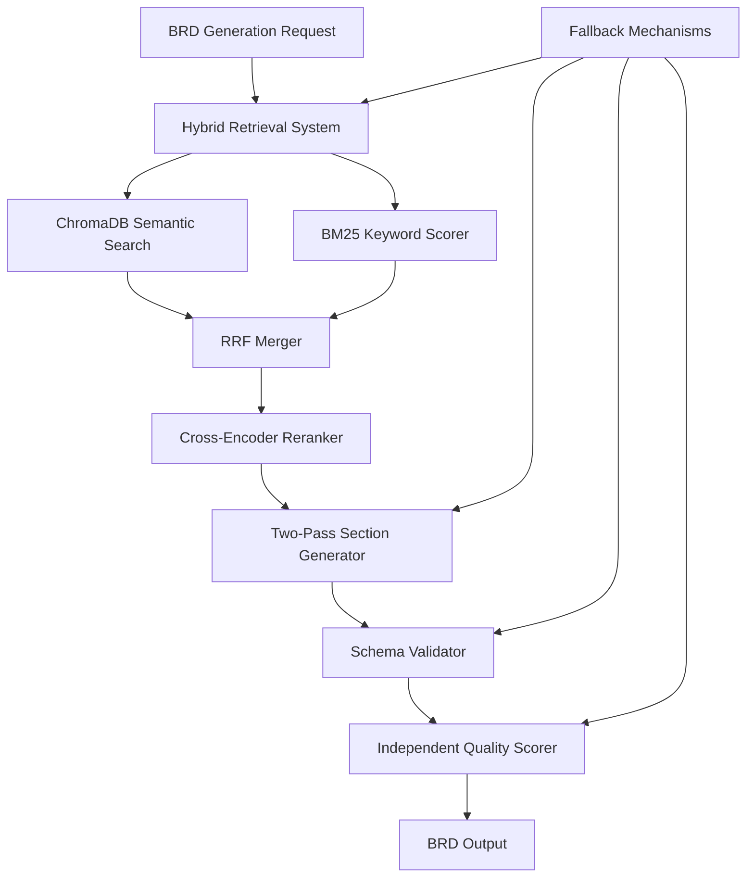

# Design Document: Hybrid Retrieval Upgrade

## Overview

This design document outlines the technical architecture for upgrading DocuMind's BRD generation pipeline from keyword-based retrieval to a hybrid retrieval system. The upgrade combines BM25 keyword scoring with existing semantic embeddings using Reciprocal Rank Fusion (RRF), adds cross-encoder re-ranking, implements two-pass BRD generation with reflection, introduces independent quality scoring, and adds schema validation with auto-retry mechanisms.

The system maintains backward compatibility while significantly improving retrieval quality through multiple complementary ranking methods. The architecture preserves existing function signatures and data structures to ensure seamless integration with the current BRD generation pipeline.

### Key Improvements

- **Hybrid Retrieval**: Combines BM25 keyword scoring with semantic embeddings via RRF fusion
- **Cross-Encoder Re-ranking**: Applies lightweight cross-encoder models for final relevance scoring
- **Two-Pass Generation**: Implements critique-and-rewrite loops for improved section quality
- **Independent Quality Assessment**: Uses separate evaluator models for unbiased quality scoring
- **Schema Validation**: Ensures consistent output structure with automatic retry mechanisms
- **Performance Optimization**: Maintains sub-2-second retrieval times with enhanced accuracy

## Architecture

### System Components



### Data Flow Architecture

The hybrid retrieval system processes queries through multiple stages:

1. **Candidate Retrieval**: Fetch 20 candidates from ChromaDB using semantic similarity
2. **BM25 Scoring**: Calculate keyword relevance scores for all candidates
3. **RRF Fusion**: Merge semantic and keyword rankings using reciprocal rank fusion
4. **Cross-Encoder Re-ranking**: Apply cross-encoder scoring to top candidates
5. **Section Generation**: Use two-pass generation with critique and rewrite
6. **Schema Validation**: Validate output structure with auto-retry on failures
7. **Quality Assessment**: Independent evaluation using separate judge model

### Integration Points

The system integrates with existing DocuMind components:

- **ChromaDB Client**: Leverages existing vector database connections
- **Firestore**: Maintains current caching and storage mechanisms  
- **Gemini API**: Extends current AI model usage for generation and evaluation
- **BRD Pipeline**: Preserves existing function signatures and data structures

## Components and Interfaces

### BM25 Scorer Component

```typescript
interface BM25Scorer {
  calculateScore(query: string, document: string): number;
  preprocessText(text: string): string[];
  normalizeScore(score: number, maxScore: number): number;
}

interface BM25Parameters {
  k1: number; // Term frequency saturation parameter (1.2)
  b: number;  // Length normalization parameter (0.75)
}
```

The BM25 scorer implements the standard BM25 algorithm with configurable parameters. It handles text preprocessing through tokenization, lowercasing, and punctuation removal. Score normalization ensures compatibility with semantic similarity scores for RRF fusion.

### RRF Merger Component

```typescript
interface RRFMerger {
  fuseRankings(
    semanticRanking: RankedSnippet[],
    keywordRanking: RankedSnippet[],
    k?: number
  ): RankedSnippet[];
}

interface RankedSnippet {
  snippet: RetrievalSnippet;
  rank: number;
  score: number;
  source: 'semantic' | 'keyword' | 'fused';
}
```

The RRF merger combines rankings using the formula: `RRF_score = 1/(k + rank)` where k=60. It handles tied scores through stable sorting and preserves snippet metadata throughout the fusion process.

### Cross-Encoder Reranker Component

```typescript
interface CrossEncoderReranker {
  rerank(
    query: string,
    candidates: RetrievalSnippet[],
    topK: number
  ): Promise<RetrievalSnippet[]>;
  
  scoreRelevance(query: string, document: string): Promise<number>;
}

interface RerankerConfig {
  modelPath: string;
  maxSequenceLength: number;
  batchSize: number;
  timeoutMs: number;
}
```

The cross-encoder reranker applies a lightweight transformer model to score query-document pairs. It operates on the top 20 candidates from RRF fusion and returns the 8 highest-scoring snippets.

### Two-Pass Section Generator

```typescript
interface TwoPassGenerator {
  generateSection(
    sectionConfig: SectionConfig,
    snippets: RetrievalSnippet[],
    model: GenerativeModel
  ): Promise<GeneratedSection>;
  
  critiqueAndRewrite(
    draft: string,
    evidence: string,
    sectionType: string,
    model: GenerativeModel
  ): Promise<string>;
}

interface GeneratedSection {
  id: string;
  content: string;
  rawContent: string;
  snippetIds: string[];
  snippets: RetrievalSnippet[];
  passCount: number;
  validationStatus: 'valid' | 'invalid' | 'needs_review';
}
```

The two-pass generator creates draft sections in Pass 1, then critiques and rewrites them in Pass 2. It maintains a 2000-token budget across both passes and handles API failures gracefully.

### Independent Quality Scorer

```typescript
interface IndependentQualityScorer {
  evaluateQuality(brd: BRDSections): Promise<QualityAssessment>;
  
  scoreCompleteness(sections: BRDSections): Promise<number>;
  scoreClarity(sections: BRDSections): Promise<number>;
  scoreConsistency(sections: BRDSections): Promise<number>;
  scoreEvidence(sections: BRDSections): Promise<number>;
}

interface QualityAssessment {
  completeness: number;
  clarity: number;
  consistency: number;
  evidence: number;
  overall: number;
  reasoning: string;
  timestamp: string;
  evaluatorModel: string;
}
```

The independent quality scorer uses a separate Gemini API call with an evaluator system prompt. It acts as an unbiased judge, assessing four explicit criteria and providing detailed reasoning.

### Schema Validator Component

```typescript
interface SchemaValidator {
  validateSection(section: any, sectionType: string): ValidationResult;
  
  retryGeneration(
    originalPrompt: string,
    validationErrors: string[],
    model: GenerativeModel
  ): Promise<string>;
}

interface ValidationResult {
  isValid: boolean;
  errors: string[];
  warnings: string[];
}

interface BRDSectionSchema {
  requirement_id: string;
  description: string;
  acceptance_criteria: string[];
  priority: "MUST" | "SHOULD" | "COULD";
  evidence: {
    snippet_id: string;
    source: string;
  }[];
  stakeholder: string;
}
```

The schema validator ensures consistent output structure using TypeScript schema definitions. It automatically retries generation with validation errors appended to prompts when validation fails.

## Data Models

### Enhanced Retrieval Snippet

```typescript
interface RetrievalSnippet {
  text: string;
  id: string;
  metadata: {
    filename: string;
    classification: string;
    timestamp: string;
    projectId: string;
    chunkIndex?: number;
  };
  scores?: {
    semantic?: number;
    bm25?: number;
    crossEncoder?: number;
    rrf?: number;
  };
  rankings?: {
    semantic?: number;
    bm25?: number;
    final?: number;
  };
}
```

### BRD Section Configuration

```typescript
interface SectionConfig {
  id: string;
  prompt: string;
  maxTokens: number;
  candidateCount: number;
  resultCount: number;
  requiresValidation: boolean;
  schema?: any;
  fallbackBehavior: 'semantic_only' | 'keyword_only' | 'existing_method';
}
```

### Quality Score Result

```typescript
interface QualityScoreResult {
  composite: number;
  completeness: { total: number; breakdown: any };
  consistency: { total: number; breakdown: any };
  clarity: { total: number; breakdown: any };
  evidence: { total: number; breakdown: any };
  grade: "A" | "B" | "C" | "D" | "F";
  timestamp: string;
  brdVersion: string;
  evaluationMethod: 'independent' | 'deterministic';
  reasoning?: string;
}
```
## Correctness Properties

*A property is a characteristic or behavior that should hold true across all valid executions of a system-essentially, a formal statement about what the system should do. Properties serve as the bridge between human-readable specifications and machine-verifiable correctness guarantees.*

After analyzing the acceptance criteria, several properties can be combined for more comprehensive testing while eliminating redundancy. For example, multiple BM25 text preprocessing requirements can be combined into a single comprehensive property, and several API compatibility requirements can be consolidated.

### Property 1: BM25 Score Mathematical Correctness

*For any* query and document pair, BM25 scores should increase with higher term frequency and higher inverse document frequency, and all scores should be normalized to the 0-1 range.

**Validates: Requirements 1.1, 1.5**

### Property 2: BM25 Text Preprocessing Consistency

*For any* text input, the BM25 scorer should apply consistent preprocessing (lowercase conversion, punctuation removal, whitespace splitting, Unicode handling) to both queries and documents, producing identical tokens for identical input text.

**Validates: Requirements 1.2, 7.1, 7.2, 7.3, 7.4, 7.5**

### Property 3: RRF Fusion Algorithm Correctness

*For any* two input rankings, the RRF merger should apply the formula RRF_score = 1/(k + rank) with k=60, handle tied scores with stable ordering, and preserve all snippet metadata through the fusion process.

**Validates: Requirements 2.1, 2.3, 2.4, 2.5**

### Property 4: Hybrid Retrieval Candidate Processing

*For any* section query, the hybrid retrieval system should calculate BM25 scores for all retrieved candidates and apply RRF fusion when both semantic and keyword scores are available.

**Validates: Requirements 3.2, 3.3**

### Property 5: Backward Compatibility Preservation

*For any* existing function call to retrieveForSection, the hybrid system should return the same data structure format and process requests without breaking changes while maintaining caching and filtering behavior.

**Validates: Requirements 4.2, 4.3, 4.4, 4.5**

### Property 6: Fallback Behavior Consistency

*For any* component failure (BM25, semantic, RRF, or cross-encoder), the system should fall back gracefully to alternative methods, log fallback events, and never return empty results when valid snippets exist.

**Validates: Requirements 6.1, 6.2, 6.3, 6.4, 6.5**

### Property 7: ChromaDB Integration Preservation

*For any* retrieval request, the hybrid system should use existing ChromaDB functions, preserve query filters, normalize semantic scores for RRF fusion, and respect cache invalidation mechanisms.

**Validates: Requirements 8.2, 8.3, 8.4, 8.5**

### Property 8: Cross-Encoder Scoring Completeness

*For any* set of 20 candidates, the cross-encoder reranker should score all candidates, sort by relevance scores in descending order, and preserve the expected output interface.

**Validates: Requirements 9.1, 9.3, 9.5**

### Property 9: Cross-Encoder Error Handling

*For any* empty or malformed query, or cross-encoder failure, the system should handle errors gracefully by returning RRF-ranked results.

**Validates: Requirements 9.6, 9.8**

### Property 10: Two-Pass Generation Token Management

*For any* section generation, the two-pass generator should allocate a total of 2000 tokens across both passes and rewrite sections based on critique feedback while preserving evidence arrays.

**Validates: Requirements 10.4, 10.5, 10.6**

### Property 11: Two-Pass Generation Fallback

*For any* API failure in Pass 2, the generator should fall back to the Pass 1 draft while maintaining function signatures and return formats.

**Validates: Requirements 10.8**

### Property 12: Quality Evaluation Completeness

*For any* BRD input, the quality evaluator should assess all four criteria (completeness, clarity, consistency, evidence) and return scores in the correct JSON format with 0-100 scale values.

**Validates: Requirements 11.4, 11.6, 11.7, 11.8, 11.9, 11.10**

### Property 13: Quality Scoring Fallback

*For any* API failure in quality evaluation, the system should fall back to the existing deterministic scoring method while maintaining the same function interface.

**Validates: Requirements 11.12**

### Property 14: Schema Validation Round-Trip

*For any* generated section, the validator should validate against the TypeScript schema, retry with validation errors on first failure, and flag with "NEEDS_REVIEW" on second failure.

**Validates: Requirements 12.1, 12.3, 12.4**

### Property 15: Schema Validation Safety

*For any* validation failure, the system should log error details, never silently save invalid sections, and handle errors without breaking the overall BRD generation process.

**Validates: Requirements 12.5, 12.6, 12.8**

## Error Handling

### Graceful Degradation Strategy

The system implements a multi-level fallback hierarchy:

1. **Primary**: Hybrid retrieval with cross-encoder re-ranking
2. **Fallback Level 1**: Hybrid retrieval without cross-encoder (RRF fusion only)
3. **Fallback Level 2**: Semantic-only retrieval (existing ChromaDB)
4. **Fallback Level 3**: Keyword-only retrieval (existing scoreSnippet function)

### Error Recovery Mechanisms

**BM25 Scoring Failures**: Log error and continue with semantic-only retrieval. Maintain performance by skipping BM25 calculation for remaining candidates.

**ChromaDB Connection Issues**: Fall back to cached snippets if available within TTL. If cache is empty, return error with retry suggestion.

**Cross-Encoder Model Loading**: Gracefully degrade to RRF fusion results. Log model loading failure for monitoring.

**API Rate Limiting**: Implement exponential backoff with jitter for Gemini API calls. Queue requests during rate limit periods.

**Schema Validation Failures**: Retry generation once with validation errors appended to prompt. Flag sections requiring manual review after second failure.

**Memory Constraints**: Implement batch processing for large candidate sets. Process candidates in chunks of 10 to stay within memory limits.

### Monitoring and Observability

**Performance Metrics**: Track retrieval latency, BM25 calculation time, RRF fusion duration, and cross-encoder inference time.

**Quality Metrics**: Monitor fallback frequency, schema validation failure rates, and quality score distributions.

**Error Tracking**: Log all component failures with context for debugging. Include query characteristics and candidate counts in error reports.

## Testing Strategy

### Dual Testing Approach

The system requires both unit testing and property-based testing for comprehensive coverage:

**Unit Tests**: Focus on specific examples, edge cases, and integration points between components. Test API compatibility, configuration validation, and error handling scenarios.

**Property Tests**: Verify universal properties across all inputs using randomized test data. Test mathematical correctness of BM25 and RRF algorithms, consistency of text preprocessing, and robustness of fallback mechanisms.

### Property-Based Testing Configuration

**Testing Library**: Use `fast-check` for TypeScript property-based testing with minimum 100 iterations per property test.

**Test Data Generation**: Generate random queries, documents, rankings, and BRD sections to test universal properties across diverse inputs.

**Property Test Tags**: Each property test must reference its design document property using the format:
- **Feature: hybrid-retrieval-upgrade, Property 1**: BM25 Score Mathematical Correctness
- **Feature: hybrid-retrieval-upgrade, Property 2**: BM25 Text Preprocessing Consistency

### Unit Testing Focus Areas

**Component Integration**: Test interactions between BM25 scorer, RRF merger, and cross-encoder reranker components.

**API Compatibility**: Verify function signatures match existing interfaces and return expected data structures.

**Configuration Management**: Test BM25 parameters (k1=1.2, b=0.75), RRF parameter (k=60), and token budgets (2000 tokens per section).

**Error Scenarios**: Test specific failure modes like empty queries, malformed schemas, and API timeouts.

**Performance Boundaries**: Verify candidate counts (20 input, 8 output), token limits, and timeout thresholds.

### Integration Testing

**End-to-End Retrieval**: Test complete pipeline from query to final ranked results using real ChromaDB data.

**BRD Generation Pipeline**: Verify two-pass generation with schema validation using actual Gemini API calls.

**Quality Scoring Integration**: Test independent quality evaluation with separate model instances.

**Caching Behavior**: Verify cache hits, TTL expiration, and invalidation mechanisms work correctly with hybrid retrieval.

### Performance Testing

**Latency Requirements**: Verify retrieval completes within 2 seconds, BM25 scoring within 100ms, RRF fusion within 50ms, and cross-encoder re-ranking within 500ms.

**Concurrency Testing**: Test multiple simultaneous section retrievals to ensure no performance degradation.

**Memory Usage**: Monitor memory consumption during candidate processing and cross-encoder inference.

**Load Testing**: Test system behavior under high query volumes and large candidate sets.